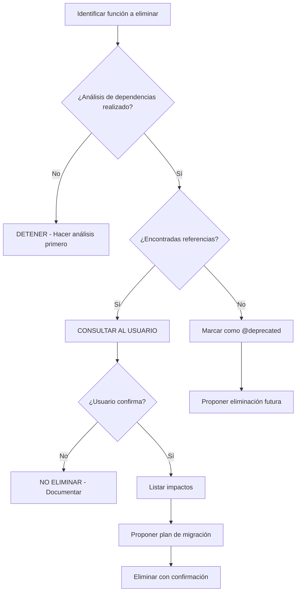

# Guía de Contribución - GeConnect

## 📋 Tabla de Contenidos

1. [Principios Fundamentales](#-principios-fundamentales)
2. [Análisis y Modificación de Código](#-análisis-y-modificación-de-código)
3. [Código Simple, Robusto y Escalable](#-código-simple-robusto-y-escalable)
4. [Estándares Técnicos](#-estándares-técnicos)
5. [Presentación de Cambios](#-presentación-de-cambios)
6. [Patrones de Diseño](#-patrones-de-diseño)
7. [Checklist de Calidad](#-checklist-de-calidad)
8. [Mejores Prácticas](#-mejores-prácticas)
9. [Guía de Respuesta](#-guía-de-respuesta)
10. [Sistema de Versionado Universal](#-sistema-de-versionado-universal)
11. [Regla Crítica de Preservación de Código](#-regla-crítica-de-preservación-de-código)

---

## 🎯 Principios Fundamentales

### Análisis Exhaustivo Obligatorio

**Antes de modificar cualquier código, se debe realizar un análisis completo que incluya:**

#### Pasos del Análisis

1. **Identificación de Componentes**
   - Listar archivos que serán modificados
   - Identificar dependencias directas e indirectas
   - Verificar impacto en módulos relacionados

2. **Análisis de Contexto**
   - Revisar archivos abiertos en el IDE
   - Examinar arquitectura existente
   - Identificar patrones de diseño utilizados
   - Verificar convenciones de nomenclatura

3. **Evaluación de Riesgos**
   - Detectar código periférico que NO debe modificarse
   - Identificar funciones críticas del sistema
   - Evaluar compatibilidad con versiones anteriores

4. **Planificación de Cambios**
   - Definir alcance preciso
   - Establecer orden de implementación
   - Preparar plan de rollback

---

## 🔧 Análisis y Modificación de Código

### Regla de Objetividad en Cambios de Código

**Cuando se analiza un archivo, función o proceso específico:**

#### ✅ **HACER:**
- Analizar **SOLO** el código directamente relacionado con el objetivo
- Modificar **ÚNICAMENTE** las funciones que causan el problema o necesitan la funcionalidad
- Mantener el resto del código sin cambios
- Documentar claramente QUÉ se modificó y POR QUÉ

#### ❌ **NO HACER:**
- Modificar código periférico que funciona correctamente
- Refactorizar funciones no relacionadas con el objetivo
- Cambiar estilos de código existente sin motivo técnico
- Eliminar funciones que están siendo utilizadas en otros componentes

---

## 📦 Código Simple, Robusto y Escalable

### Principios de Diseño

1. **Simplicidad**
   - Usar soluciones directas y claras
   - Evitar sobre-ingeniería
   - Código autoexplicativo

2. **Robustez**
   - Validaciones exhaustivas
   - Manejo de errores completo
   - Logs detallados para debugging

3. **Escalabilidad**
   - Código reutilizable
   - Bajo acoplamiento
   - Alta cohesión

---

## 🔢 Sistema de Versionado Universal

### 📌 Regla General de Versionado (APLICACIÓN UNIVERSAL)

**TODOS los componentes de código que se generen, actualicen o modifiquen DEBEN incluir un sistema de versionado explícito en los comentarios de documentación.**

### 🎯 Alcance del Versionado

El versionado se aplica **OBLIGATORIAMENTE** a:

| Tipo de Componente | Lenguaje | Formato de Documentación | Ejemplo |
|-------------------|----------|--------------------------|---------|
| **Funciones** | JavaScript/TypeScript | JSDoc | `/** ✅ ACTUALIZADO v2.0 */` |
| **Métodos** | C# | XML Documentation | `/// <summary>✅ NUEVO v1.0</summary>` |
| **Actions** | C# (ASP.NET) | XML Documentation | `/// <summary>✅ ACTUALIZADO v3.0</summary>` |
| **Clases** | C# / JavaScript | XML Doc / JSDoc | `/// <summary>✅ REFACTORIZADO v2.0</summary>` |
| **Interfaces** | C# / TypeScript | XML Doc / JSDoc | `/// <summary>✅ ACTUALIZADO v1.5</summary>` |
| **Servicios** | C# | XML Documentation | `/// <summary>✅ OPTIMIZADO v2.1</summary>` |
| **Controladores** | C# (ASP.NET) | XML Documentation | `/// <summary>✅ NUEVO v1.0</summary>` |
| **DTOs con Lógica** | C# | XML Documentation | `/// <summary>✅ ACTUALIZADO v1.2</summary>` |
| **Helpers/Utilities** | JavaScript/C# | JSDoc / XML Doc | `/** ✅ CORREGIDO v1.1 */` |
| **Vistas Parciales** | Razor/HTML | Razor Comments | `@* ✅ ACTUALIZADO v2.0 *@` |
| **Stored Procedures** | SQL | SQL Comments | `-- ✅ OPTIMIZADO v3.0` |
| **Queries LINQ** | C# | Inline Comments | `// ✅ REFACTORIZADO v2.0` |

### 📝 Formatos de Versionado por Lenguaje

#### 1️⃣ JavaScript/TypeScript (JSDoc)

```javascript
/**
 * ✅ NUEVO v1.0: Valida cliente antes de seleccionar
 * 
 * @param {jQuery} $row - Fila de la grilla con data-attributes
 * @returns {boolean} true si válido, false si bloqueado
 */
function validarClienteAntesDeSeleccionar($row) {
    // código
}

/**
 * ✅ ACTUALIZADO v2.0: Agregado soporte para múltiples orígenes
 * 
 * Cambios desde v1.0:
 * - Agregado: Validación de origen "N" (No Habilitado)
 * - Modificado: Ahora retorna objeto con detalles del error
 * 
 * @param {jQuery} $row - Fila de la grilla
 * @param {string} origen - Origen del cliente (C/F/N)
 * @returns {Object} { valido: boolean, mensaje: string }
 */
function validarClienteAntesDeSeleccionar($row, origen) {
    // código actualizado
}
```

#### 2️⃣ C# - Métodos y Funciones (XML Documentation)

```csharp
/// <summary>
/// ✅ NUEVO v1.0: Busca cliente por criterio
/// </summary>
/// <param name="criterio">CUIT, DNI o ID</param>
/// <returns>JSON con datos del cliente</returns>
[HttpPost]
public async Task<JsonResult> BuscarCliente(string criterio)
{
    // código
}

/// <summary>
/// ✅ ACTUALIZADO v2.0: Agregado soporte para búsqueda por email
/// 
/// Cambios desde v1.0:
/// - Agregado: Detección automática de tipo de criterio
/// - Modificado: Validación mejorada de parámetros
/// - Optimizado: Reduce llamadas a servicio externo
/// </summary>
/// <param name="criterio">CUIT, DNI, ID o email</param>
/// <param name="tipoBusqueda">Tipo de búsqueda (auto-detectado si es null)</param>
/// <returns>JSON con datos completos del cliente</returns>
[HttpPost]
public async Task<JsonResult> BuscarCliente(string criterio, string? tipoBusqueda = null)
{
    // código actualizado
}
```

#### 3️⃣ C# - Clases y Servicios

```csharp
/// <summary>
/// ✅ NUEVO v1.0: Servicio para gestión de clientes en caja
/// 
/// Proporciona operaciones CRUD para clientes en el contexto de facturación.
/// </summary>
public class ClienteServicio : IClienteServicio
{
    // implementación
}

/// <summary>
/// ✅ REFACTORIZADO v2.0: Servicio reorganizado con inyección de dependencias
/// 
/// Cambios desde v1.0:
/// - Refactorizado: Ahora usa patrón Repository
/// - Agregado: Soporte para transacciones
/// - Optimizado: Cache de resultados frecuentes
/// </summary>
public class ClienteServicio : IClienteServicio
{
    private readonly IClienteRepository _repository;
    private readonly IMemoryCache _cache;
    
    // nueva implementación
}
```

#### 4️⃣ Razor Views (Comentarios Razor)

```razor
@* 
✅ NUEVO v1.0: Modal para identificar cliente
Permite búsqueda por CUIT, DNI o ID
*#
<div class="modal" id="modalIdentificarCliente">
    @* contenido *@
</div>

@* 
✅ ACTUALIZADO v2.0: Agregado botón de edición para consumidores finales

Cambios desde v1.0:
- Agregado: Botón "Editar" visible solo para origen F
- Modificado: Layout responsivo mejorado
- Corregido: Validación de campos vacíos
*#
<div class="modal" id="modalIdentificarCliente">
    @* contenido actualizado *@
    <button id="btnEditarCliente" style="display: none;">EDITAR</button>
</div>
```

#### 5️⃣ SQL - Stored Procedures

```sql
-- ===================================================================
-- ✅ NUEVO v1.0: Procedimiento para buscar clientes
-- Búsqueda por CUIT, DNI o ID
-- ===================================================================
CREATE PROCEDURE sp_BuscarCliente
    @Criterio NVARCHAR(50)
AS
BEGIN
    -- código
END

-- ===================================================================
-- ✅ OPTIMIZADO v2.0: Agregado índice y optimización de JOIN
-- 
-- Cambios desde v1.0:
-- - Optimizado: Usa índice en cta_documento
-- - Modificado: JOIN con tabla de tipos de documento
-- - Agregado: Filtro por estado activo
-- ===================================================================
ALTER PROCEDURE sp_BuscarCliente
    @Criterio NVARCHAR(50),
    @SoloActivos BIT = 1
AS
BEGIN
    -- código optimizado
END
```

#### 6️⃣ Interfaces y Contratos

```csharp
/// <summary>
/// ✅ NUEVO v1.0: Contrato para servicios de cliente
/// </summary>
public interface IClienteServicio
{
    Task<Cliente> BuscarPorId(string id);
}

/// <summary>
/// ✅ ACTUALIZADO v2.0: Agregados métodos para consumidores finales
/// 
/// Cambios desde v1.0:
/// - Agregado: ActualizarConsumidorFinal
/// - Agregado: ObtenerClienteActual (desde sesión)
/// </summary>
public interface IClienteServicio
{
    Task<Cliente> BuscarPorId(string id);
    Task<bool> ActualizarConsumidorFinal(ActualizarClienteDto dto);
    Cliente? ObtenerClienteActual();
}
```

### 🏷️ Tipos de Versiones y Uso

| Prefijo | Uso | Cuándo Aplicar | Incremento |
|---------|-----|----------------|------------|
| **✅ NUEVO** | Primera implementación | Componente creado por primera vez | `v1.0` |
| **✅ ACTUALIZADO** | Mejora/ampliación de funcionalidad | Nuevas características, parámetros, lógica | Mayor `v2.0` |
| **✅ CORREGIDO** | Fix de bug | Corrección sin cambiar funcionalidad | Menor `v2.1` |
| **✅ OPTIMIZADO** | Mejora de rendimiento | Mejora de performance sin cambiar lógica | Menor `v2.2` |
| **✅ REFACTORIZADO** | Reestructuración | Cambio de arquitectura/patrón | Mayor `v3.0` |
| **✅ DEPRECADO** | Marcado para eliminación | Función obsoleta pero aún disponible | Patch `v2.2.1` |

### 📋 Reglas de Incremento de Versión

#### Versión MAYOR (x.0)
Se incrementa cuando:
- ✅ Se agregan nuevas funcionalidades significativas
- ✅ Se cambia la firma (parámetros, tipo de retorno)
- ✅ Se modifica el comportamiento principal
- ✅ Se refactoriza completamente la arquitectura
- ✅ Cambios que rompen compatibilidad hacia atrás

**Ejemplos:**
```csharp
// v1.0 → v2.0
// ANTES
public JsonResult BuscarCliente(string criterio)

// DESPUÉS (agregado parámetro origen)
public JsonResult BuscarCliente(string criterio, string origen)
```

#### Versión MENOR (x.y)
Se incrementa cuando:
- ✅ Se corrigen bugs sin cambiar funcionalidad
- ✅ Se optimiza rendimiento
- ✅ Se mejoran validaciones
- ✅ Se agregan logs/documentación
- ✅ Cambios compatibles hacia atrás

**Ejemplos:**
```csharp
// v2.0 → v2.1
// ANTES
if (cliente == null) return null;

// DESPUÉS (validación mejorada)
if (cliente == null || string.IsNullOrEmpty(cliente.Id)) 
{
    _logger.LogWarning("Cliente inválido");
    return null;
}
```

#### Versión PATCH (x.y.z) - Opcional
Se usa cuando:
- ✅ Correcciones menores de typos
- ✅ Ajustes de formato/estilo
- ✅ Cambios en comentarios
- ✅ No afecta lógica de ejecución

### 📊 Ejemplos Completos por Tipo de Componente

#### Action de Controlador (ASP.NET Core)

```csharp
/// <summary>
/// ✅ NUEVO v1.0: Busca cliente y retorna datos básicos
/// </summary>
[HttpPost]
public async Task<JsonResult> BuscarCliente(string criterio)
{
    // v1.0: implementación básica
}

/// <summary>
/// ✅ ACTUALIZADO v2.0: Agregado almacenamiento en sesión
/// 
/// Cambios desde v1.0:
/// - Agregado: Guarda cliente en ClienteActual (sesión)
/// - Agregado: Validación de origen "N" (No Habilitado)
/// - Modificado: Retorna datos fiscales completos automáticamente
/// </summary>
[HttpPost]
public async Task<JsonResult> BuscarCliente(string criterio)
{
    // v2.0: implementación mejorada con sesión
}
```

#### Servicio

```csharp
/// <summary>
/// ✅ NUEVO v1.0: Obtiene datos completos del cliente
/// </summary>
private async Task<Cliente> ObtenerDatosCompletos(string id)
{
    // v1.0: implementación
}

/// <summary>
/// ✅ REFACTORIZADO v2.0: Ahora retorna tupla con estado
/// 
/// Cambios desde v1.0:
/// - Refactorizado: Retorna (bool ok, string mensaje, Cliente? datos)
/// - Agregado: Manejo de errores granular
/// - Optimizado: Una sola llamada a base de datos
/// </summary>
private async Task<(bool ok, string mensaje, Cliente? datos)> ObtenerDatosCompletos(string id)
{
    // v2.0: nueva implementación
}
```

#### Helper/Utility Function

```javascript
/**
 * ✅ NUEVO v1.0: Obtiene descripción del tipo de documento
 * 
 * @param {string} tdocId - ID del tipo de documento (80, 86, 96, etc.)
 * @returns {string} Descripción legible (CUIT, CUIL, DNI, etc.)
 */
function obtenerDescripcionTipoDoc(tdocId) {
    const tipos = {
        '80': 'CUIT',
        '86': 'CUIL',
        '96': 'D.N.I.'
    };
    return tipos[tdocId] || 'Desconocido';
}

/**
 * ✅ ACTUALIZADO v1.1: Agregados tipos faltantes
 * 
 * Cambios desde v1.0:
 * - Agregado: Soporte para todos los tipos de documento AFIP
 * - Agregado: Parámetro opcional formato (corto/largo)
 */
function obtenerDescripcionTipoDoc(tdocId, formato = 'corto') {
    // implementación ampliada
}
```

### ✅ Checklist de Versionado Universal

Antes de commit, verificar para **CADA COMPONENTE MODIFICADO**:

- [ ] ¿Tiene comentario de documentación (JSDoc/XML/Razor)?
- [ ] ¿El comentario incluye versión (ej: `v2.0`)?
- [ ] ¿Se especifica el tipo de cambio (NUEVO/ACTUALIZADO/CORREGIDO/OPTIMIZADO/REFACTORIZADO)?
- [ ] ¿Se documentan los cambios respecto a la versión anterior?
- [ ] ¿El número de versión es coherente con el tipo de cambio?
- [ ] ¿Se aplica a TODOS los tipos de componentes (actions, métodos, funciones, clases, etc.)?
- [ ] ¿El versionado usa el formato correcto según el lenguaje?

### 🎯 Beneficios del Versionado Universal

| Beneficio | Descripción | Impacto |
|-----------|-------------|---------|
| **Trazabilidad Completa** | Historia de cambios en TODO el código | Alto |
| **Debugging Facilitado** | Identificar cuándo se introdujo un cambio | Alto |
| **Code Review Eficiente** | Revisores entienden contexto inmediato | Medio |
| **Documentación Viva** | El código se autodocumenta | Alto |
| **Onboarding Rápido** | Nuevos devs comprenden evolución | Medio |
| **Rollback Preciso** | Revertir a versiones específicas | Alto |
| **Auditoría de Calidad** | Rastrear mejoras y correcciones | Medio |

---

## 🚨 Regla Crítica de Preservación de Código

### 🔒 Prohibición Absoluta de Eliminación No Verificada

**ANTES de eliminar, renombrar o modificar la firma de CUALQUIER componente, se DEBE:**

#### 1️⃣ Análisis de Dependencias Obligatorio

Verificar referencias en:

| Ubicación | Qué Buscar | Herramienta |
|-----------|------------|-------------|
| **Mismo archivo** | Llamadas internas | Búsqueda en archivo |
| **Otros archivos JS** | Importaciones, llamadas | Búsqueda global |
| **Vistas Razor/HTML** | `onclick`, `onchange`, atributos inline | Búsqueda en archivos `.cshtml` |
| **Controladores C#** | Retorno de URLs, referencias a funciones | Búsqueda en `.cs` |
| **Archivos CSS** | Clases, IDs referenciados | Búsqueda en `.css`, `.scss` |
| **Configuración** | Constantes, variables globales | Búsqueda en archivos de config |

#### 2️⃣ Componentes que NUNCA se Deben Eliminar Sin Verificación

| Tipo de Componente | Ejemplos | Razón |
|-------------------|----------|-------|
| **Funciones Globales** | `mostrarMensajeError()`, `AbrirMensaje()` | Pueden ser llamadas desde vistas |
| **Event Handlers** | `function inicializaEventos()` | Atados a eventos del DOM |
| **Callbacks** | Funciones pasadas como parámetros | Referenciadas dinámicamente |
| **Variables Globales** | `let clienteSeleccionado` | Compartidas entre módulos |
| **Constantes de URL** | `BuscarClienteUrl` | Usadas en AJAX |
| **Selectores CSS** | `.btn-seleccionar-cliente` | Usados en JavaScript |
| **IDs de Elementos** | `#modalIdentificarCliente` | Referenciados en múltiples lugares |

#### 3️⃣ Proceso Obligatorio Antes de Eliminar



#### 4️⃣ Ejemplo de Análisis CORRECTO

```javascript
// ❌ INCORRECTO: Eliminar sin verificar
// function mostrarMensajeError() { ... } // ← ELIMINADA

// ✅ CORRECTO: Verificar referencias primero

// Paso 1: Buscar referencias
// Encontradas en:
// - fact.js líneas: 298, 332, 362, 395, 427, 456, ...
// - _IdentificarClienteModal.cshtml (posibles llamadas inline)
// - ClienteController.cs (puede retornar mensajes de error)

// Paso 2: Consultar al usuario
// "Se encontraron 15+ referencias a mostrarMensajeError(). 
//  ¿Desea eliminarla? Esto requerirá refactorizar todos estos puntos."

// Paso 3: Si se confirma, proporcionar lista completa y plan
```

#### 5️⃣ Alternativa: Marcar como Deprecado

Si una función parece obsoleta pero no se está seguro:

```javascript
/**
 * @deprecated desde v2.0 - Usar mostrarNotificacion() en su lugar
 * @todo Eliminar en v3.0 después de migrar todas las referencias
 * 
 * Esta función se mantiene temporalmente para retrocompatibilidad.
 * ADVERTENCIA: No usar en código nuevo.
 */
function mostrarMensajeError(mensaje) {
    console.warn('⚠️ mostrarMensajeError() está deprecada. Usar mostrarNotificacion()');
    // Implementación existente...
}
```

#### 6️⃣ Mensajes de Consulta al Usuario

Cuando se detecta una posible eliminación:

```markdown
⚠️ ATENCIÓN: Eliminación de Componente Detectada

Componente: mostrarMensajeError()
Tipo: Función global
Referencias encontradas: 15 ubicaciones

Ubicaciones:
1. fact.js:298 - Validación de búsqueda
2. fact.js:332 - Error AJAX
3. fact.js:362 - Validación de origen
...

¿Desea proceder con la eliminación?
- [ ] Sí, eliminar y refactorizar todas las referencias
- [ ] No, marcar como @deprecated
- [ ] Cancelar operación

Si confirma, se debe:
1. Reemplazar todas las llamadas con nueva implementación
2. Actualizar tests afectados
3. Documentar el cambio en CHANGELOG
```

#### 7️⃣ Checklist de Verificación Pre-Eliminación

Antes de eliminar CUALQUIER componente:

- [ ] ✅ Búsqueda global realizada (Ctrl+Shift+F en IDE)
- [ ] ✅ Revisados archivos abiertos en el IDE
- [ ] ✅ Verificadas vistas Razor/HTML
- [ ] ✅ Revisados controladores C#
- [ ] ✅ Verificados archivos JavaScript relacionados
- [ ] ✅ Consultado al usuario sobre el impacto
- [ ] ✅ Plan de migración documentado
- [ ] ✅ Referencias listadas completamente

#### 8️⃣ Excepciones Permitidas

Solo se puede eliminar sin consulta previa si:

1. ✅ Es una función privada local de scope limitado
2. ✅ Fue creada en la misma sesión de trabajo (nueva)
3. ✅ Está explícitamente marcada como `// TODO: Eliminar`
4. ✅ Es código comentado de depuración

#### 9️⃣ Ejemplo Real del Error Detectado

```javascript
// ❌ LO QUE PASÓ (ERROR):
// Se eliminó mostrarMensajeError() sin verificar dependencias

// Consecuencia:
// Uncaught ReferenceError: mostrarMensajeError is not defined
//     at Object.success (fact.js:832:17)

// ✅ LO QUE DEBIÓ HACERSE:

// Paso 1: Detectar que se usará en múltiples lugares
// Paso 2: Consultar: "Esta función tiene 15+ referencias. ¿Eliminar?"
// Paso 3: Si se confirma, proporcionar lista y plan
// Paso 4: Implementar alternativa antes de eliminar
```

#### 🔟 Herramientas para Análisis de Dependencias

| Herramienta | Uso | Comando |
|-------------|-----|---------|
| **Búsqueda Global** | Encontrar referencias | `Ctrl+Shift+F` (VS Code) |
| **Find All References** | Rastrear uso de símbolos | `Shift+F12` |
| **Grep** | Búsqueda en consola | `grep -r "nombreFuncion" .` |
| **ESLint** | Detectar código no usado | `eslint --report-unused-disable-directives` |
| **TypeScript** | Análisis estático | `tsc --noUnusedLocals` |

---

## 🎨 Estándares Técnicos

### Nomenclatura
- **C#:** PascalCase para métodos, propiedades y clases
- **JavaScript:** camelCase para funciones y variables
- **Constantes:** UPPER_SNAKE_CASE
- **Privados:** _camelCase (C#)

### Comentarios
- **SIEMPRE** incluir versionado en componentes modificados
- Documentar el "por qué", no solo el "qué"
- Usar emojis para categorizar logs (🔍 🚀 ✅ ❌ ⚠️)

### Logs
```javascript
console.log('✅ Operación exitosa'); // Success
console.error('❌ Error crítico');    // Error  
console.warn('⚠️ Advertencia');      // Warning
console.log('🔍 Depuración');        // Debug
console.log('📡 Llamada AJAX');      // Network
console.log('📊 Datos procesados');  // Data
```

---

## ✅ Checklist de Calidad

Antes de considerar completada una tarea:

- [ ] ✅ **TODOS** los componentes modificados están versionados
- [ ] ✅ Comentarios JSDoc/XML/Razor actualizados
- [ ] ✅ Validaciones exhaustivas implementadas
- [ ] ✅ Manejo de errores completo
- [ ] ✅ Logs informativos agregados
- [ ] ✅ Código probado en diferentes escenarios
- [ ] ✅ Sin código duplicado
- [ ] ✅ Sin funciones huérfanas
- [ ] ✅ Retrocompatibilidad considerada
- [ ] ✅ Versionado coherente con tipo de cambio

---

## 📝 Guía de Respuesta

Al generar respuestas:

1. **Analizar exhaustivamente** el contexto antes de responder
2. **Identificar** todas las dependencias
3. **Proponer** solución paso a paso con versionado
4. **Validar** que no se eliminen componentes en uso
5. **Documentar** con versionado universal y comentarios claros
6. **Explicar** el razonamiento detrás de cada decisión
7. **Incluir** logs detallados para debugging
8. **Versionar** TODOS los componentes (actions, métodos, funciones, clases, etc.)

---

**Última actualización:** abril 14, 2026  
**Versión del documento:** 4.0

**Cambios en esta versión:**
- ✅ NUEVO: Sección completa "Regla Crítica de Preservación de Código"
- Agregado: Proceso obligatorio antes de eliminar componentes
- Agregado: Checklist de verificación pre-eliminación
- Agregado: Ejemplos de errores comunes y cómo prevenirlos
- Agregado: Tabla de herramientas para análisis de dependencias